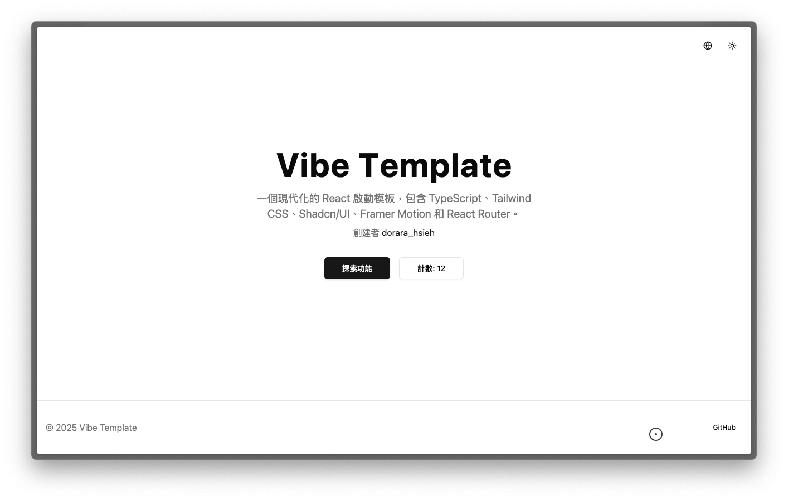

# Vibe Template

<div align="center">
  
</div>

Vibe Coding for ai developer. A modern React + Vite template with dark mode, animations, and i18n support.

[English](#english) | [繁體中文](#繁體中文)

## English

### 🚀 Quick Start

```bash
npx create-vibe-template my-app
cd my-app
pnpm install
pnpm dev
```

### ✨ Features

- 🌓 **Theme Provider** - Built-in dark mode support with system preference detection
- 🎨 **Tailwind CSS** - Utility-first CSS framework with dark mode support
- 💫 **Framer Motion** - Powerful animation library for React
- 🎯 **Shadcn/UI** - High-quality, accessible React components
- 🌐 **i18n** - Internationalization with English and Traditional Chinese support
- 📱 **React Router** - Seamless client-side routing
- 🎭 **Lucide Icons** - Beautiful and consistent icons
- 🖱️ **Custom Cursor** - Customizable cursor effects

## 繁體中文

### 🚀 快速開始

```bash
npx create-vibe-template my-app
cd my-app
pnpm install
pnpm dev
```

### ✨ 特色功能

- 🌓 **主題切換** - 內建深色模式，支援系統主題偵測
- 🎨 **Tailwind CSS** - 實用優先的 CSS 框架，支援深色模式
- 💫 **Framer Motion** - 強大的 React 動畫函式庫
- 🎯 **Shadcn/UI** - 高品質、無障礙的 React 元件
- 🌐 **i18n** - 支援中英文的國際化功能
- 📱 **React Router** - 流暢的客戶端路由
- 🎭 **Lucide Icons** - 精美且一致的圖示
- 🖱️ **自訂游標** - 可自訂的游標效果

## 📄 License

MIT License
